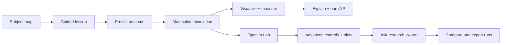

## 6. End-to-end user journey

```mermaid
flowchart LR
 A[Subject map] --> B[Guided lesson]
 B --> C[Predict outcome]
 C --> D[Manipulate simulation]
 D --> E[Visualize + measure]
 E --> F[Explain + earn XP]
 D --> G[Open in Lab]
 G --> H[Advanced controls + plots]
 H --> I[Ask research swarm]
 I --> J[Compare and export runs]
```
