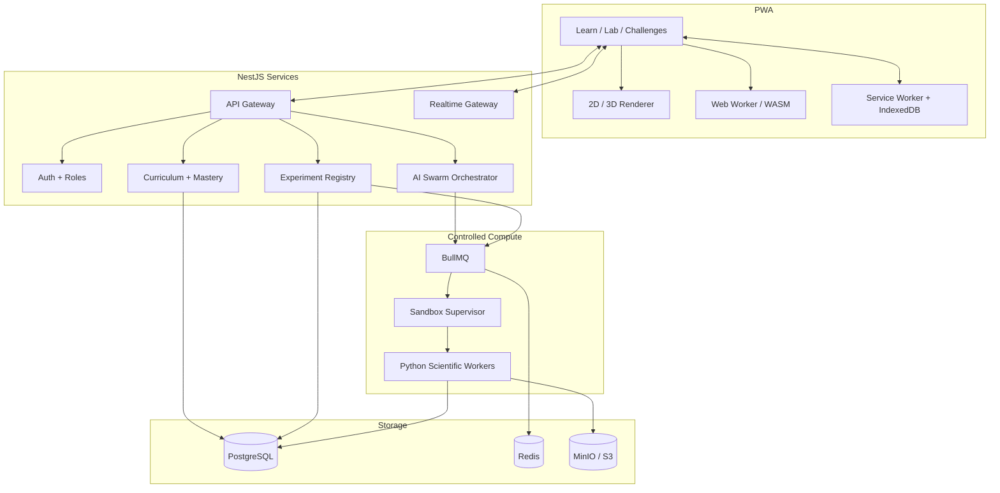

## 8. System architecture

```mermaid
flowchart TB
 subgraph Browser[PWA]
  UI[Learn / Lab / Challenges]
  Render[2D / 3D Renderer]
  Local[Web Worker / WASM]
  Offline[Service Worker + IndexedDB]
  UI --> Render
  UI --> Local
  UI <--> Offline
 end
 subgraph Backend[NestJS Services]
  API[API Gateway]
  Auth[Auth + Roles]
  Learn[Curriculum + Mastery]
  Registry[Experiment Registry]
  Agent[AI Swarm Orchestrator]
  Realtime[Realtime Gateway]
 end
 subgraph Compute[Controlled Compute]
  Queue[BullMQ]
  Supervisor[Sandbox Supervisor]
  Workers[Python Scientific Workers]
 end
 subgraph Storage[Storage]
  PG[(PostgreSQL)]
  Redis[(Redis)]
  S3[(MinIO / S3)]
 end
 UI <--> API
 UI <--> Realtime
 API --> Auth
 API --> Learn
 API --> Registry
 API --> Agent
 Learn --> PG
 Registry --> PG
 Agent --> Queue
 Registry --> Queue
 Queue --> Redis
 Queue --> Supervisor
 Supervisor --> Workers
 Workers --> S3
 Workers --> PG
```
